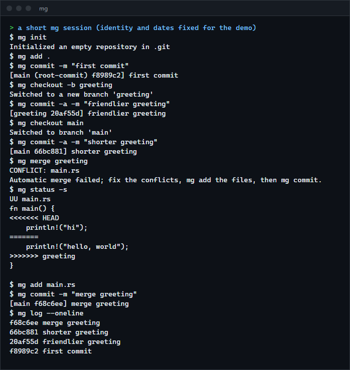
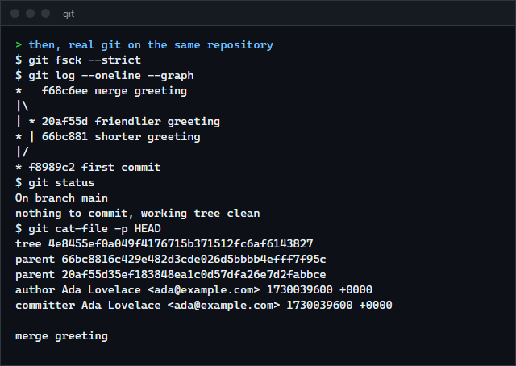

# mg

A version control system in Rust that uses git's own on-disk format, so real git can read, check and extend every repository it writes: loose objects named by SHA-1, the index file, refs and `HEAD`. It has commits, branches, tags, checkout, diff, three-way merge with conflicts, and a repository checker. For anyone who wants to see how git works underneath, with the proof that it does.

**Status:** v0.1.0, working on Windows. The Linux build is compile-checked only. No remotes and no packfiles. Not published to crates.io.





## Features

- **Same format as git.** Objects are zlib-compressed `"<type> <length>\0<content>"` named by their SHA-1; trees are sorted the way git sorts them (a directory as if its name ended in `/`); the index is version 2 with git's padding and checksum. Running the same operations with the same identity and dates in git and in `mg` gives the same commit, tree and tag ids.
- **Commands:** `init`, `add`, `rm`, `status` (long, `-s`, `--porcelain`), `commit` (`-a`, `--amend`), `log`, `show`, `diff` (work tree, `--cached`, between commits), `branch`, `checkout` (branches, commits, `-b`, paths), `restore`, `reset` (`--soft`, `--mixed`, `--hard`, paths), `tag` (lightweight and annotated), `merge` (fast-forward, three-way, `--no-ff`, `--abort`), `config`, and plumbing: `cat-file`, `hash-object`, `ls-tree`, `ls-files`, `rev-parse`, `write-tree`, `fsck`.
- **Revisions:** `HEAD`, branch and tag names, abbreviated ids, `~N`, `^N`, `^{commit}`, `^{tree}`.
- **`.gitignore`** with git's rules: negation, directory-only patterns, anchoring, `**`, nested files and `.git/info/exclude`.
- **Every object is verified when read**: the header length, the absence of trailing bytes and the hash. A damaged repository is reported, never used.
- **Checkout never loses work.** A change that would overwrite local modifications or an untracked file is refused before anything is touched. A tree that contains `.git`, `..`, backslashes or drive letters is refused too (the path tricks that have been used to attack git itself).

## How to install

Requires a recent stable Rust (built and tested with 1.98.1).

```sh
git clone https://github.com/r3clusionn/mini-vcs
cd mini-vcs
cargo install --path .
```

This installs the `mg` command. It uses `.git` as its repository directory, so run it only in repositories you are prepared to use it on (see Limits).

## How to use

```sh
mg init
mg config user.name "Your Name"
mg config user.email you@example.com
mg add .
mg commit -m "first commit"
mg checkout -b feature
mg commit -a -m "work"
mg checkout main
mg merge feature
mg log --oneline
mg diff --cached
mg status -s
```

| Command | What it does |
|---|---|
| `add [-f] PATH...` | Stage files or directories (a path that is gone is staged as deleted). Ignored files need `-f`. |
| `commit -m MSG [-a] [--amend] [--allow-empty]` | Commit the index. No editor: the message comes from `-m` (several `-m` make paragraphs) or from the merge in progress. |
| `status [-s \| --porcelain]` | Staged, unstaged and untracked changes; `UU`, `AA`, `UD` and so on for conflicts. |
| `log [-n N] [--oneline] [--format=F] [REV...]` | History, newest first. Formats: `%H %h %T %P %p %an %ae %ad %at %cn %ce %ct %s %b`. |
| `diff [--cached] [--name-status] [A [B]] [-- PATH]` | The same unified diff text git prints. |
| `checkout [-f] BRANCH \| REV`, `checkout -b NEW [REV]`, `checkout [REV] -- PATH` | Switch, create, or restore files. |
| `reset [--soft \| --mixed \| --hard] [REV]` | Move the branch; `--mixed` also resets the index, `--hard` the files. |
| `merge [--no-ff] [-m MSG] BRANCH`, `merge --abort` | Join a branch. On conflicts the files get markers, the index holds the three versions, and `mg add` plus `mg commit` finishes it. |
| `fsck` | Check every object, tree, commit and ref. Exit status 1 if anything is wrong. |

Identity comes from `GIT_AUTHOR_NAME`, `GIT_AUTHOR_EMAIL` and `GIT_AUTHOR_DATE` (and the `COMMITTER` ones) when set, otherwise from the repository config, then from your global `~/.gitconfig`. Commits are stamped in UTC (`+0000`) unless a date with a zone is given.

## How it works

- **Objects** (`odb.rs`, `object.rs`). A blob, tree, commit or tag is stored once under `objects/ab/cdef...`, written to a temporary file and renamed so a crash never leaves half an object. Commits keep unknown headers (such as `gpgsig`) so a commit made by git is written back to the same bytes.
- **The index** (`index.rs`). A sorted list of path, mode, id and stat data. Stat data lets `status` skip hashing files that have not changed, except "racily clean" ones that are as new as the index itself, which are always compared by content (a test makes this reachable and fails when the check is removed).
- **Diff** (`diff.rs`). Myers' O(ND) algorithm with the common prefix and suffix stripped, hunks with three lines of context and git's `@@ ... @@ function` suffix. The merge is a line-based three-way merge: changes that do not touch each other combine, changes to the same or adjacent lines that differ are conflicts.
- **Checkout** (`worktree.rs`). Computes the paths that differ between the current and the target tree, checks every one for local changes, untracked files in the way and unsafe names, and only then removes, writes and updates the index.
- **Speed.** Writing a loose object is mostly waiting for the file system, so `add` hashes and stores files on up to 16 threads, and `status` checks files on several threads. Before threading, adding 8,000 files took 35.8 s here, 4 ms per object.

## Benchmarks

8,000 real files (83.6 MB of Rust crate sources from `~/.cargo/registry`), Intel Core i9-14900KF, Windows 11, git 2.55.0, `mg` built with `--release`. Median of 5 runs, except `add` and the first `commit`, which can only be done once per repository. Time includes starting the process. Both tools had the same files and the same work (`scripts/bench.py`).

| Step | git | mg |
|---|---|---|
| `add .` (8,000 new files) | 5,035 ms | 3,689 ms |
| `commit` (first) | 1,258 ms | 435 ms |
| `status`, clean tree | 81 ms | 140 ms |
| `status`, 200 files modified | 95 ms | 141 ms |
| `diff`, 200 files modified | 121 ms | 142 ms |
| `add .`, 200 files modified | 324 ms | 152 ms |
| `commit`, 200 files modified | 558 ms | 236 ms |
| `checkout` between commits that differ in 200 files | 228 ms | 178 ms |
| `log --oneline`, 3,000 commits | 102 ms | 134 ms |

`mg`'s log of the 3,000-commit history is byte for byte what git prints. git is faster at `status` on an unchanged tree (81 ms against 140 ms) and at the 3,000-commit log; `mg` is faster at the steps that add, commit and switch. These are single machine, loopback-free, process-start-included timings, not a claim about git in general.

## Verification

- `cargo test --release` runs 66 unit tests, 36 integration tests that run the real binary, and a stress test. Ten of those compare `mg` with git itself (they skip, loudly, if git is missing):
  - the same operations with the same identity and dates give identical commit, tree and tag ids (including a merge commit);
  - `git fsck --strict` accepts a repository `mg` wrote (branches, a merge, annotated tags), and git's `log`, `ls-files -s`, `status --porcelain`, `branch` and `tag` agree with `mg`'s;
  - `mg` reads a repository git wrote (executable bit, empty files, a merge, an annotated tag) and prints the same `log`, `show`, `ls-tree`, `diff` and `cat-file`, then git accepts the commit `mg` adds;
  - `diff` text is identical to git's in every mode (work tree, `--cached`, between commits, binary files, files without a final newline, empty files, deleted and added files) and for 150 random edits; every diff also applies with `git apply`;
  - `.gitignore` rules give the same untracked list and the same `add .` as git for a 27-file tree, with a dozen kinds of patterns and a nested `.gitignore`;
  - clean merges give the same commit id, and conflicting merges the same file content and the same `status`, as git, in seven scenarios;
  - six random workloads of 45 steps each (edit, delete, `add`, `commit`, `commit -a`, `restore --staged`) give the same `status --porcelain` and `ls-files -s` as git after every step.
- The oracle tests found real differences while the project was written: hunk headers carry the last "function" line, blank lines in a message are indented, and git labels a conflict with the branch name as typed. All are fixed.
- Damage tests: every single-byte change of a stored object is rejected or reads back identical; truncations, wrong names, lying headers and a forged index are refused; a deleted blob, a corrupted object and a ref to nowhere are reported by `fsck`. Checkout of eight kinds of hostile tree (`.git/hooks`, `.GIT`, `git~1`, `..`, a backslash, `C:`, `file:stream`, `.git.`) is refused and leaves the work tree untouched; this caught a real bug, a checkout that removed a file before it noticed the unsafe path.
- Mutation checks, each confirmed to fail a test when removed: the tree sort rule, hash verification on read, the loss-of-changes check, the untracked-file check, the `.git` path rule, the racy-timestamp check, merge conflicts on adjacent lines, up-front path validation, message cleanup and the merge-with-local-changes refusal.

## Limits

- **Loose objects only.** Packfiles are not read: an object that exists only in a pack is reported as missing. Repositories made by `git clone`, `git fetch` or `git gc` use packs; `git unpack-objects` turns a pack back into loose objects.
- No remotes, fetch, push or clone. No stash, rebase, cherry-pick, revert, blame, submodules (a submodule entry is ignored), reflog, hooks, `.gitattributes`, line-ending conversion, sparse checkout or signing (existing signatures are kept).
- No rename or copy detection in `diff` and `merge` (git's `diff.renames` has to be off when comparing). The merge takes the first merge base when there are several, handles text files by lines, and treats a file/directory name clash as an error.
- `mg` writes `.git/index` version 2 and drops optional extensions such as the tree cache (git rebuilds them); it refuses an index with a version other than 2 or 3 or with a required extension. Do not run it in a repository that uses split index or index version 4.
- Timestamps are UTC unless a zone is given in `GIT_AUTHOR_DATE`. On Windows a symbolic link is written as a file holding its target, as git does with `core.symlinks=false`.
- SHA-1 is broken against deliberate collisions; git adds detection of the known attack pattern, `mg` does not.
- Only Windows was run.

## License

MIT (see `LICENSE`).
